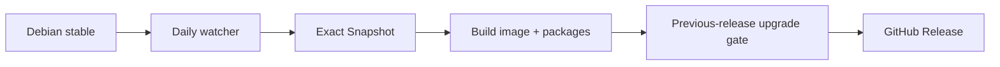

# AtlANTian GNU/Linux

[](https://github.com/BlackF1re/atlantian/releases)
[](https://github.com/BlackF1re/atlantian/actions/workflows/build-release.yml)
[](https://github.com/BlackF1re/atlantian/actions/workflows/debian-watch.yml)
[](https://github.com/BlackF1re/atlantian/actions/workflows/ci.yml)
[](LICENSE)

**AtlANTian** is a compact Debian GNU/Linux distribution for the Bitmain
Antminer S9 **CTRL_C41** control board. It turns the Xilinx Zynq-7010 board into
a small general-purpose Linux/FPGA platform instead of a mining appliance.

| Platform | AtlANTian policy |
|---|---|
| SoC | Xilinx Zynq-7010, dual Cortex-A9 + programmable logic |
| RAM | 512 MiB DDR3 |
| Debian | current compatible Debian stable, `armhf`, selected automatically |
| Kernel | pinned board-tested Linux 6.12 LTS line |
| Storage | microSD: FAT boot + ext4 root; NAND remains separate |
| FPGA | FPGA Manager/Region + DT overlays + optional PL profiles |
| Updates | live Debian APT + staged AtlANTian package upgrades |
| Releases | reproducible factory image, automatically refreshed from Debian |

> [!NOTE]
> AtlANTian stays deliberately close to Debian. Debian owns normal userspace and
> package maintenance; this repository owns the board description, kernel
> policy, FPGA plumbing, factory image and AtlANTian release tooling.

## Design at a glance

| Goal | Implementation |
|---|---|
| Fresh packages | installed systems use live codename-pinned Debian repositories |
| Reproducible images | factory rootfs is built from an immutable Debian Snapshot |
| Safe Debian majors | only one major at a time; `armhf` and repositories are preflighted |
| Safe AtlANTian updates | exact three-package set, SHA-256 verification and downgrade guards |
| Persistent system | ordinary Debian `/etc`, `/root`, `/home` and `/var` survive updates |
| Release confidence | every candidate is tested against the previous published image |
| Low maintenance | daily Debian watcher + monthly grouped GitHub Actions dependency checks |

## Quick start

1. Download the newest `.img` and `SHA256SUMS` from [GitHub Releases](https://github.com/BlackF1re/atlantian/releases).
2. Verify the download: `sha256sum -c SHA256SUMS --ignore-missing`.
3. Write the image to a microSD card with Rufus, Raspberry Pi Imager, Etcher or `dd`.
4. Select SD boot on CTRL_C41 and power the board from 12 V.
5. Connect over DHCP Ethernet or 3.3 V UART (`115200 8N1`).

```sh
cat /etc/os-release
uname -a
lsblk
networkctl
atlantian-fpga status
```

> [!IMPORTANT]
> A fresh image intentionally permits root login with an empty password for
> first-time appliance-style provisioning, similar to OpenWrt. Keep the board on
> a trusted network until you run `passwd` or install your own SSH key.

Full procedure: **[Quick Start](docs/QUICKSTART.md)**.

## Hardware status

| Function | Status | Notes |
|---|---|---|
| microSD boot/root | Ready | first boot expands ext4 root |
| Gigabit Ethernet | Ready | MACB/GEM, DHCP, persistent local MAC |
| UART | Ready | `ttyPS0`, 115200 8N1 |
| NAND | Ready | 256 MiB MTD, UBI/UBIFS, software BCH ECC |
| D2/D3 + S1/S2 | Ready | Linux LED/input plumbing |
| XADC | Ready | IIO + hwmon |
| Watchdog | Ready | `/dev/watchdog0`; policy remains conservative |
| FPGA loading | Ready | FPGA Manager/Region + configfs overlays |
| D5-D8 | Profile | shipped `status-leds` PL profile |
| USB | Disabled by default | known MIO conflict; requires validated routing/profile |
| Other PL I/O | Profile-dependent | matching bitstream + DT overlay required |
| RTC | Not fitted | systemd-timesyncd restores network time |

Electrical evidence and profile boundaries: **[Hardware support matrix](docs/hardware-support-matrix.md)**.

## Release model



The watcher runs daily at **06:00 Asia/Tomsk**. It tracks Debian stable without
hard-coding one codename forever. A new Debian major is accepted only when it is
the next major, still publishes `armhf`, has main/updates/security available and
passes a real rootfs preflight.

Installed systems do **not** wait for a new image to receive Debian package
updates:

```sh
apt update
apt upgrade
apt install git python3 tmux
```

The runtime repository uses the installed codename rather than the moving
`stable` alias, so a normal APT operation cannot silently perform a Debian major
upgrade.

More detail: **[Debian lifecycle](docs/DEBIAN-LIFECYCLE.md)**.

## Updating AtlANTian

```sh
atlantian-sysupgrade --check
atlantian-sysupgrade --notes
atlantian-sysupgrade
```

| Update type | Tool | What changes |
|---|---|---|
| Debian packages | `apt` | normal userspace packages within the installed Debian major |
| AtlANTian release | `atlantian-sysupgrade` | platform policy, board kernel, DT/FPGA support and release tooling |
| Debian major | `atlantian-sysupgrade` | staged one-major transition with third-party APT sources disabled/backed up |

Interrupted major transitions are recorded and resumable. See
**[Upgrading](docs/UPGRADING.md)**.

## Release safety

Production publication is gated by:

- immutable Debian Snapshot, Linux and `BOOT.bin` pins;
- shell/YAML/source contracts and image-layout checks;
- exact package/release identity and SHA-256 checks;
- frozen-build vs live-runtime APT separation;
- rootfs ownership, first-boot identity and SSH-host-key checks;
- updater/LED lifecycle contracts;
- a QEMU/chroot upgrade from the latest older published AtlANTian image;
- preservation checks for machine ID, SSH host key, `/etc`, `/root`, `/home`,
  `/var`, custom APT state and `/boot` replacement;
- negative downgrade, skipped-major and unauthorized-major tests;
- a final check that the build commit is still the tip of `main`.

Release artifacts also receive GitHub/Sigstore build-provenance attestations.
Hardware-only behavior such as Zynq boot and physical FPGA/I/O remains a real-board
validation boundary.

## Building locally

```sh
git clone https://github.com/BlackF1re/atlantian.git
cd atlantian
sudo ./scripts/bootstrap-host.sh
./scripts/validate-release-inputs.sh
./scripts/build-incremental.sh all
```

Useful targets: `rootfs`, `kernel`, `image`, `all`. Published releases are
produced only from `main` by GitHub Actions.

## Documentation

| Need | Read |
|---|---|
| First boot | [Quick Start](docs/QUICKSTART.md) |
| Update an installed board | [Upgrading](docs/UPGRADING.md) |
| Debian automation | [Debian lifecycle](docs/DEBIAN-LIFECYCLE.md) |
| Build/release internals | [Release pipeline](docs/PIPELINE.md) |
| Hardware and FPGA boundaries | [Hardware support matrix](docs/hardware-support-matrix.md) |
| Persistent state | [Persistence](docs/PERSISTENCE.md) |
| Security/trust model | [Security policy](SECURITY.md) |
| Contributing | [Contributing](CONTRIBUTING.md) |
| All docs | [Documentation index](docs/README.md) |

## Important boundaries

- `poweroff` halts Linux but cannot disconnect the external 12 V supply.
- There is no battery-backed RTC.
- The base DT intentionally keeps the conflicted PS USB route disabled.
- A DT overlay describes PL hardware; a matching FPGA bitstream must implement it.
- Reflashing intentionally creates a new machine ID and SSH host identity.
- `boot-candidate/BOOT.bin` is a pinned external vendor binary, not a reproducible
  build product of this repository.

## License

AtlANTian-specific source code is licensed under **GPL-2.0-only**. Debian,
Linux, U-Boot, FPGA components and other third-party material retain their own
licenses.
