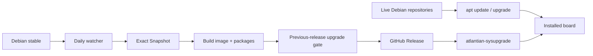

# AtlANTian GNU/Linux

[](https://github.com/BlackF1re/atlantian/releases)
[](https://github.com/BlackF1re/atlantian/actions/workflows/build-release.yml)
[](https://github.com/BlackF1re/atlantian/actions/workflows/debian-watch.yml)
[](https://github.com/BlackF1re/atlantian/actions/workflows/ci.yml)
[](LICENSE)

**AtlANTian** is a compact Debian GNU/Linux distribution for the Bitmain
Antminer S9 **CTRL_C41** control board. It turns the Xilinx Zynq-7010 board into
a small general-purpose Linux/FPGA platform instead of a mining appliance.

<p align="center">
  <a href="#quick-start"><b>Install</b></a> ·
  <a href="#updating-atlantian"><b>Update</b></a> ·
  <a href="#hardware-status"><b>Hardware</b></a> ·
  <a href="#contributor-fast-path"><b>Contribute</b></a> ·
  <a href="#release-model"><b>Release model</b></a> ·
  <a href="docs/README.md"><b>All docs</b></a>
</p>

| Platform | AtlANTian policy |
|---|---|
| SoC | Xilinx Zynq-7010, dual Cortex-A9 + programmable logic |
| RAM | 512 MiB or 1 GiB DDR3, detected at boot; no Linux `mem=` cap |
| Debian | current compatible Debian stable, `armhf`, selected automatically |
| Kernel | pinned CTRL_C41 board kernel, updated deliberately |
| Storage | microSD: FAT boot + ext4 root; NAND remains separate |
| FPGA | FPGA Manager/Region + DT overlays + optional PL profiles |
| Updates | live Debian APT + staged AtlANTian package upgrades |
| Releases | reproducible factory image, automatically refreshed from Debian |

> [!NOTE]
> AtlANTian stays deliberately close to Debian. Debian owns normal userspace and
> package maintenance; this repository owns the board description, kernel
> policy, FPGA plumbing, factory image and AtlANTian release tooling.

## Start here

Everything needed to use or modify AtlANTian is linked here.

| I want to… | Read |
|---|---|
| flash and boot the board | **[Quick Start](docs/QUICKSTART.md)** |
| update Debian or AtlANTian | **[Upgrading](docs/UPGRADING.md)** |
| understand automatic Debian releases | **[Debian lifecycle](docs/DEBIAN-LIFECYCLE.md)** |
| understand build, CI and publication | **[Release pipeline](docs/PIPELINE.md)** |
| change DT, FPGA or board support | **[Hardware support matrix](docs/hardware-support-matrix.md)** |
| know what survives upgrades | **[Persistence](docs/PERSISTENCE.md)** |
| understand trust/security boundaries | **[Security policy](SECURITY.md)** |
| inspect/replace `BOOT.bin` | **[Boot firmware input](boot-candidate/README.md)** |
| submit code or documentation | **[Contributing](CONTRIBUTING.md)** |
| browse the whole documentation set | **[Documentation index](docs/README.md)** |

> [!TIP]
> **New contributor?** Start with [Contributing](CONTRIBUTING.md), then open the
> source-of-truth document for the subsystem you intend to touch. Hardware claims
> should always be checked against the [hardware matrix](docs/hardware-support-matrix.md).

## Contributor fast path

| Change | Read first | After merge to `main` |
|---|---|---|
| README / docs | [Contributing](CONTRIBUTING.md) | documentation only; no production image |
| CI / GitHub automation | [Pipeline](docs/PIPELINE.md) | workflow-only unless a build input also changes |
| Debian selection / APT | [Debian lifecycle](docs/DEBIAN-LIFECYCLE.md) + [Upgrading](docs/UPGRADING.md) | normally produces a new release |
| rootfs / packaging / updater | [Pipeline](docs/PIPELINE.md) + [Persistence](docs/PERSISTENCE.md) | new release + previous-release upgrade gate |
| kernel / DT | [Hardware matrix](docs/hardware-support-matrix.md) + [Pipeline](docs/PIPELINE.md) | new release; real-board validation still matters |
| `BOOT.bin` | [Boot firmware input](boot-candidate/README.md) + [Pipeline](docs/PIPELINE.md) | new release; explicit hardware validation required |
| FPGA / PL profile | [Hardware matrix](docs/hardware-support-matrix.md) | new release when bundled into the base/profile set |
| security-sensitive behavior | [Security policy](SECURITY.md) | review trust boundary and release impact first |

<details>
<summary><b>Contributor pre-flight commands</b></summary>

```sh
bash scripts/test-source-contracts.sh
bash scripts/test-update-leds.sh
bash scripts/validate-release-inputs.sh
```

For a full local build:

```sh
sudo ./scripts/bootstrap-host.sh
./scripts/build-incremental.sh all
```

PR CI also validates shell, YAML, documentation links and release-input
contracts.

</details>

## Design at a glance

| Goal | Implementation |
|---|---|
| Fresh packages | installed systems use live codename-pinned Debian repositories |
| Reproducible images | factory rootfs is built from an immutable Debian Snapshot |
| Safe Debian majors | only one major at a time; `armhf` and repositories are preflighted |
| Safe AtlANTian updates | exact three-package set, SHA-256 verification and downgrade guards |
| Persistent system | ordinary Debian `/etc`, `/root`, `/home` and `/var` survive normal updates |
| RAM portability | U-Boot probes installed DDR and fixes the DT; ARM HIGHMEM remains enabled |
| Release confidence | every release after the first is tested against the previous published image |
| Low maintenance | daily Debian watcher + grouped Dependabot maintenance for GitHub Actions |

## Quick start

1. Download the newest `.img` and `SHA256SUMS` from [GitHub Releases](https://github.com/BlackF1re/atlantian/releases).
2. Verify the download: `sha256sum -c SHA256SUMS --ignore-missing`.
3. Write the image to a microSD card with Rufus, Raspberry Pi Imager, Etcher or `dd`.
4. Select SD boot on CTRL_C41 and power the board from 12 V.
5. Connect over DHCP Ethernet or 3.3 V UART (`115200 8N1`).

```sh
cat /etc/os-release
uname -a
lsblk
networkctl
grep MemTotal /proc/meminfo
atlantian-fpga status
```

> [!IMPORTANT]
> A fresh image intentionally permits root login with an empty password for
> first-time appliance-style provisioning, similar to OpenWrt. Keep the board on
> a trusted network until you run `passwd` or install your own SSH key.

Full procedure: **[Quick Start](docs/QUICKSTART.md)**.

## Hardware status

| Function | Status | Notes |
|---|---|---|
| DDR3 | Ready | 512 MiB and 1 GiB boards use the same image; size is bootloader-detected |
| microSD boot/root | Ready | first boot expands ext4 root |
| Gigabit Ethernet | Ready | MACB/GEM, DHCP, persistent local MAC |
| UART | Ready | `ttyPS0`, 115200 8N1 |
| NAND | Ready | 256 MiB MTD, UBI/UBIFS, software BCH ECC |
| D2/D3 + S1/S2 | Ready | Linux LED/input plumbing |
| XADC | Ready | IIO + hwmon |
| Watchdog | Ready | `/dev/watchdog0`; policy remains conservative |
| FPGA loading | Ready | FPGA Manager/Region + configfs overlays |
| D5-D8 | Profile | shipped `status-leds` PL profile |
| USB | Disabled | known MIO conflict; requires validated routing/profile |
| Other PL I/O | Profile | matching bitstream + DT overlay required |
| RTC | Not fitted | network time after cold boot |

> [!NOTE]
> Linux intentionally reports slightly less memory than the nominal DRAM
> capacity: board-reserved regions and normal kernel reservations are excluded.
> AtlANTian does not subtract an additional fixed `mem=` allowance.

> [!WARNING]
> Driver support does not prove safe physical routing. USB and profile-dependent
> PL functions stay disabled/profile-only until board wiring and pin ownership
> are validated.

Electrical evidence, exact pins, memory sizing, power behavior and profile boundaries:
**[Hardware support matrix](docs/hardware-support-matrix.md)**.

## Release model



The watcher runs daily at **06:00 Asia/Tomsk**. It tracks Debian stable without
hard-coding one codename forever. A new Debian major is accepted only when it is
the next major, still publishes `armhf`, has main/updates/security available and
passes a real rootfs preflight.

Installed systems do **not** wait for a new image to receive Debian package
updates:

```sh
apt update
apt upgrade
apt install git python3 tmux
```

The runtime repository uses the installed codename rather than moving `stable`,
so normal APT cannot silently perform a Debian-major upgrade.

More detail: **[Debian lifecycle](docs/DEBIAN-LIFECYCLE.md)**.

## Updating AtlANTian

```sh
atlantian-sysupgrade --check
atlantian-sysupgrade --notes
atlantian-sysupgrade
```

| Update type | Tool | Scope |
|---|---|---|
| Debian packages | `apt` | userspace within the installed Debian major |
| AtlANTian release | `atlantian-sysupgrade` | platform, board kernel, DT/FPGA support and release tooling |
| Debian major | `atlantian-sysupgrade` | staged one-major transition; third-party APT sources are backed up/disabled |

> [!NOTE]
> Interrupted Debian-major transitions are recorded and resumable. Third-party
> repositories are preserved for manual review rather than silently reused on a
> new Debian major.

Full procedure and recovery: **[Upgrading](docs/UPGRADING.md)**.

## Release safety

Production publication fails closed. A candidate is not published unless its
build, source contracts and upgrade-compatibility checks pass.

<details>
<summary><b>Show the publication gates</b></summary>

- immutable Debian Snapshot, Linux and `BOOT.bin` pins;
- shell/YAML/source contracts and image-layout checks;
- dynamic-memory contract: no Linux `mem=` cap, 1 GiB DT probe ceiling and HIGHMEM;
- exact package/release identity and SHA-256 checks;
- frozen-build vs live-runtime APT separation;
- rootfs ownership, first-boot identity and SSH-host-key checks;
- updater/LED lifecycle contracts;
- QEMU/chroot upgrade from the latest older published AtlANTian image;
- preservation of machine ID, SSH host key and representative persistent state;
- negative downgrade, skipped-major and unauthorized-major tests;
- final verification that the build commit is still the tip of `main`.

Release artifacts also receive GitHub/Sigstore build-provenance attestations.

</details>

> [!CAUTION]
> CI cannot prove physical Zynq boot, FPGA wiring or electrical behavior. Those
> remain explicit real-board validation boundaries.

## Building locally

<details>
<summary><b>Show local build commands</b></summary>

```sh
git clone https://github.com/BlackF1re/atlantian.git
cd atlantian
sudo ./scripts/bootstrap-host.sh
./scripts/validate-release-inputs.sh
./scripts/build-incremental.sh all
```

Useful targets: `rootfs`, `kernel`, `image`, `all`.

</details>

Published releases are produced only from `main` by GitHub Actions.

## Repository map

<details>
<summary><b>Show repository layout</b></summary>

| Path | Purpose |
|---|---|
| `board/` | canonical CTRL_C41 device tree |
| `config/` | Debian, kernel, package and image policy |
| `kernel-overlay/` | kernel-side OF/configfs support |
| `fpga/` | shipped FPGA profiles and firmware |
| `systemd/` | board services and first-boot policy |
| `scripts/` | build, package, update and validation tooling |
| `boot-candidate/` | pinned external boot firmware |
| `docs/` | operator, developer and hardware documentation |
| `.github/workflows/` | PR CI, Debian watcher and production release automation |

</details>

## Important boundaries

<details>
<summary><b>Show board and trust boundaries</b></summary>

- `poweroff` halts Linux but cannot disconnect the external 12 V supply.
- Suspend/hibernate are not advertised as recoverable board states.
- There is no battery-backed RTC.
- The base DT intentionally keeps the conflicted PS USB route disabled.
- A DT overlay describes PL hardware; a matching FPGA bitstream must implement it.
- Reflashing intentionally creates a new machine ID and SSH host identity.
- [`BOOT.bin`](boot-candidate/README.md) is a pinned external vendor binary, not a
  reproducible build product of this repository.

</details>

## License

AtlANTian-specific source code is licensed under **GPL-2.0-only**. Debian,
Linux, U-Boot, FPGA components and other third-party material retain their own
licenses.
