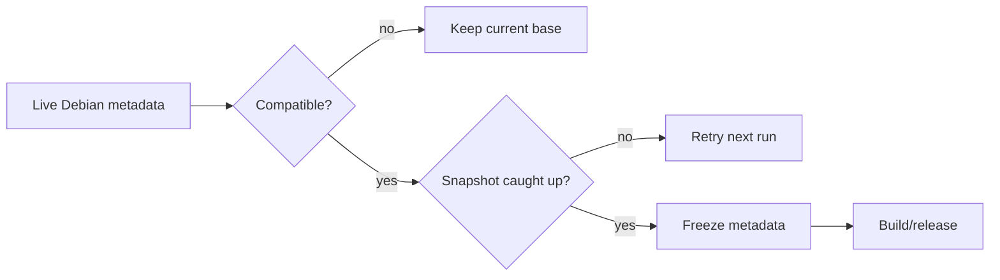

# Debian lifecycle

AtlANTian follows Debian stable automatically while keeping factory images
reproducible and installed systems protected from accidental major upgrades.

## Policy

| Rule | Behavior |
|---|---|
| Architecture | `armhf` must be officially published |
| Current Debian | live metadata is compared with the pinned factory Snapshot |
| Next Debian | only `current major + 1` is eligible |
| Repositories | main, updates and security must all exist |
| Snapshot | must contain byte-for-byte matching Release metadata |
| Running board | uses its fixed codename, never moving `stable` |
| Failed automation | fail closed; keep the last compatible base |

## Daily watcher

At **06:00 Asia/Tomsk**:

1. read the configured Debian codename/major;
2. inspect Debian `stable`, `oldstable` and `oldoldstable` aliases;
3. detect an eligible next major without skipping generations;
4. verify `armhf` in main, updates and security;
5. wait until Snapshot matches the observed live Release files;
6. freeze the exact metadata and update AtlANTian's base generation;
7. preflight a real rootfs if this is a new Debian major;
8. commit the frozen base and dispatch the production release workflow.

## Future Debian codenames

The build does not require the GitHub runner's installed `debootstrap` package
to already know the new codename. If the codename-specific script is missing,
AtlANTian uses Debian's generic `sid` bootstrap script while still targeting the
selected codename and immutable Snapshot.

> [!IMPORTANT]
> If a future Debian stable drops `armhf`, AtlANTian deliberately stays on the
> last compatible Debian release instead of publishing an unusable image.

## Running systems

Factory construction and runtime package access are intentionally separate:

| Factory image | Installed board |
|---|---|
| exact Snapshot | live Debian repositories |
| reproducible package baseline | current packages/security fixes |
| codename/major recorded | same codename until explicit AtlANTian major upgrade |

A normal `apt upgrade` stays inside the current Debian major.

## Debian-major upgrade on-device

`atlantian-release-check` scans published releases and prefers a newer
same-major bridge release before the next major. `atlantian-sysupgrade` then:

1. fully updates the current Debian major;
2. backs up and disables third-party APT source files;
3. installs the next-major AtlANTian package set;
4. installs the managed next-codename Debian base template;
5. performs `full-upgrade`;
6. records/resumes interrupted transitions when necessary;
7. reboots.

See [Upgrading](UPGRADING.md) for operator instructions.

## Liveness and recovery

| Situation | Automation response |
|---|---|
| Snapshot is behind live Debian | retry on the next daily run |
| new major is only partially published | keep current base and retry |
| production build fails after a base freeze | retry until that generation has a published release |
| repository is otherwise quiet | monthly heartbeat keeps scheduled workflow active |
| scheduler was inactive for a long time | `stable`/`oldstable`/`oldoldstable` allow sequential recovery |

No old installed image can gain updater logic retroactively. Very old releases
should first install the newest reachable same-major AtlANTian release before a
Debian-major transition.
