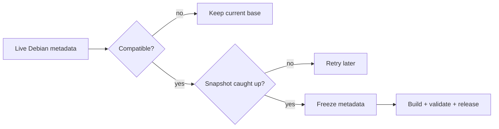

# Debian lifecycle

AtlANTian follows Debian stable automatically while keeping factory images
reproducible and installed systems protected from accidental major upgrades.

## Policy

| Rule | Behavior |
|---|---|
| Architecture | `armhf` must be officially published |
| Current Debian | changed live Release metadata is accepted only after Snapshot matches it |
| Next Debian | only `current major + 1` is eligible |
| Required suites | main, updates and security must all exist |
| Factory input | exact Snapshot metadata is pinned |
| Running board | fixed codename; never moving `stable` |
| Failure mode | fail closed and keep the last compatible base |

## Daily watcher

At **06:00 Asia/Tomsk** the repository automation:

1. reads the configured Debian codename/major;
2. inspects Debian `stable`, `oldstable` and `oldoldstable` aliases;
3. detects an eligible next major without skipping generations;
4. verifies `armhf` in main, updates and security;
5. waits until Snapshot matches the observed live Release files;
6. freezes exact metadata and advances the AtlANTian base generation;
7. preflights a real rootfs when promoting to a new Debian major;
8. commits the frozen base and dispatches the production build.

## Future Debian codenames

The build does not require the GitHub runner's `debootstrap` package to already
know a new codename. If its codename-specific script is missing, AtlANTian uses
Debian's generic `sid` bootstrap script while still targeting the selected
codename and immutable Snapshot.

> [!IMPORTANT]
> If a future Debian stable drops `armhf`, AtlANTian deliberately stays on the
> last compatible release rather than publishing an unusable image.

## Factory vs running system

| Factory image | Installed board |
|---|---|
| exact Snapshot | live Debian repositories |
| reproducible package baseline | current package/security fixes |
| codename/major recorded | same codename until explicit AtlANTian major upgrade |

A normal `apt upgrade` stays inside the current Debian major.

## Debian-major upgrade on-device

`atlantian-release-check` prefers a newer same-major bridge release before the
next major. `atlantian-sysupgrade` then:

1. fully updates the current Debian major;
2. backs up and disables third-party APT source files;
3. installs the next-major AtlANTian package set;
4. switches the managed Debian base to the next codename;
5. performs the Debian `full-upgrade`;
6. records/resumes interrupted transitions when necessary;
7. reboots.

Operator procedure: [Upgrading](UPGRADING.md).

## Liveness and recovery

| Situation | Automation response |
|---|---|
| Snapshot is behind live Debian | retry on the next daily run |
| new major is partially published | keep current base and retry |
| production build fails after a base freeze | retry until that generation has a release |
| repository is otherwise quiet | monthly heartbeat keeps scheduled workflow active |
| watcher missed releases | stable aliases permit sequential recovery while the missing next major is still in Debian's alias window |

The watcher still never skips a Debian major. If external infrastructure changes
beyond what the alias window can represent, that is an explicit maintenance
event rather than a guessed automatic migration.
