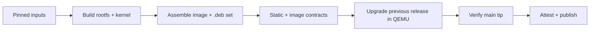
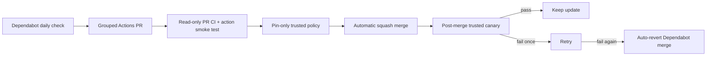

# Build and release pipeline

AtlANTian produces one factory SD image and three version-matched Debian
packages: `atlantian-platform`, `atlantian-kernel` and `atlantian-release`.



## Release identity

Format:

```text
<Debian major>.<base generation>.<source revision>+g<source commit>
```

Example: `13.1.1+g0123456789ab`.

| Field | Meaning |
|---|---|
| `13` | Debian major |
| first `1` | AtlANTian Debian-base generation |
| second `1` | monotonic Git source revision |
| `g0123456789ab` | exact source commit suffix |

The source revision is the commit count of the release commit. The Debian
watcher resets the **base generation** to `1` on a Debian-major promotion and
increments it when newly frozen Debian repository metadata changes within that
major.

## Debian automation

The scheduled watcher runs daily and delegates selection policy to
`scripts/refresh-debian-base.sh`.

| Check | Rule |
|---|---|
| Current base | freeze a change only after Snapshot matches live Release metadata |
| Next Debian major | exactly `current + 1` |
| Architecture | required suites must still publish `armhf` |
| New codename | generic debootstrap fallback is available |
| Failed release | watcher retries while the frozen generation has no release |
| Quiet repository | monthly heartbeat keeps scheduled Actions active |

A commit created with `GITHUB_TOKEN` does not recursively trigger another push
workflow, so the watcher explicitly dispatches the production build after it
freezes a new Debian base.

## Factory rootfs vs runtime APT

| Stage | Repository policy |
|---|---|
| Factory build | immutable `snapshot.debian.org` input |
| Published provenance | Snapshot timestamp + Release hashes + resolved package manifest |
| Running board | live repositories for the installed Debian codename |

This keeps factory images reproducible without turning an installed board into a
package time capsule.

## Kernel and boot

- Linux source is pinned to one immutable upstream stable commit.
- Board kernel config is checked for required Zynq/FPGA interfaces and ARM HIGHMEM.
- The Linux command line must not contain a fixed `mem=` limit.
- Board DTs expose the 1 GiB S9 probe ceiling; U-Boot supplies the detected DDR bank at boot.
- `BOOT.bin` is a separately pinned external vendor trust boundary.
- `atlantian-kernel` stores boot assets under `/usr/lib/atlantian/boot`.
- Package post-install copies `zImage`, `uImage` and DTB to FAT `/boot`.

See [Boot firmware input](../boot-candidate/README.md) for the one pinned binary
component that this repository does not rebuild from source.

## Publication gates

| Gate | What it protects |
|---|---|
| immutable input validation | Debian/kernel/BOOT inputs cannot drift silently |
| source and shell contracts | lifecycle/build invariants remain present |
| dynamic-memory contract | no Linux RAM cap; 1 GiB probe ceiling and HIGHMEM remain intact |
| image-layout tests | partitions, boot memory contract, ownership and first-boot identity stay valid |
| package identity checks | the three `.deb` files cannot be mixed/mis-versioned |
| updater/LED contract | update-state behavior remains coherent |
| previous-release upgrade test | candidate can replace the prior release safely |
| final `main` tip check | a superseded build cannot publish |
| SHA-256 + provenance | release bytes and build origin are independently inspectable |

Release publication uses the GitHub-hosted runner's `gh release` command rather
than a third-party release Action. Build provenance remains produced by GitHub's
official attestation Action.

<details>
<summary><strong>Previous-release upgrade gate</strong></summary>

For every release after the first, production CI downloads the newest published
AtlANTian image older than the candidate and verifies it with the release's
`SHA256SUMS`. It expands the disposable image, mounts FAT `/boot` + ext4 root and
runs the package transition under `armhf` QEMU/binfmt chroot.

The gate checks:

- installation of the exact three-package candidate set;
- downgrade, skipped-major and unauthorized-major rejection;
- legacy Snapshot-to-live-APT migration;
- `/boot` replacement and package/version markers;
- `dpkg --audit` and repository reachability;
- machine ID, SSH host key and representative persistent-state preservation.

For a one-major Debian transition it also performs the target Debian
`full-upgrade` and verifies the resulting codename.

> [!NOTE]
> QEMU validates userspace/package transitions. Zynq boot, FPGA configuration,
> Ethernet PHY and physical I/O remain real-board validation boundaries.

</details>

## Caches

| Cache | Safety property |
|---|---|
| Linux source/build | key includes kernel and board inputs |
| rootfs archive | numeric owners, modes, xattrs and ACLs are preserved |
| boot artifacts | invalidated by kernel/board inputs |

Cached rootfs state is restamped with the current release identity before
packaging.

## GitHub Actions maintenance

GitHub Actions infrastructure is designed to maintain itself without routine
operator work.



| Control | Policy |
|---|---|
| ecosystem | only `github-actions`; Debian is never managed by Dependabot |
| cadence | daily version check; available updates are grouped |
| allowed external Actions | `actions/checkout`, `actions/cache`, `actions/upload-artifact`, `actions/attest-build-provenance` |
| pinning | every external Action must use a full 40-hex immutable commit SHA |
| PR permissions | normal Dependabot PR CI is read-only |
| auto-merge | only a successful Dependabot PR that changes Action pins and optional version comments, nothing else |
| trusted merge gate | `workflow_run`; validates API diff and never executes PR code with a write token |
| post-merge canary | checkout, cache save/restore, artifact upload, GitHub API and provenance attestation |
| recovery | retry once; a second failure on the current Dependabot merge is automatically reverted |

> [!IMPORTANT]
> Automatic dependency merging is deliberately narrower than normal contributor
> merging. A structural workflow edit, a new third-party Action or a floating
> `@vN` reference cannot pass the trusted pin-only gate.

The policy implementation is `.github/scripts/actions-policy.py`. The canary and
recovery workflows are intentionally separate from the production release path,
so routine infrastructure maintenance does not create a new AtlANTian image.

## Installed updates

`atlantian-release-check` selects only reachable releases.
`atlantian-sysupgrade` verifies exact package names, SHA-256 values and embedded
versions before installation.

See [Upgrading](UPGRADING.md) for administrator behavior and
[Debian lifecycle](DEBIAN-LIFECYCLE.md) for automatic base selection.
