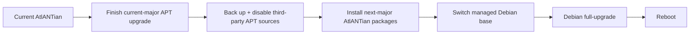

# Upgrading AtlANTian

AtlANTian uses **two update mechanisms**:

| Goal | Tool | Scope |
|---|---|---|
| update Debian packages | `apt` | userspace within the installed Debian major |
| update AtlANTian | `atlantian-sysupgrade` | platform package, board kernel and release tooling |
| move to next Debian major | `atlantian-sysupgrade` | staged one-major Debian transition |

> [!NOTE]
> Runtime APT is pinned to the installed Debian **codename**, not the moving
> `stable` alias. A normal `apt upgrade` therefore cannot silently jump to a new
> Debian major.

## Normal Debian maintenance

```sh
apt update
apt upgrade
apt install <package>
```

These commands use Debian's live main, updates and security repositories for the
installed codename.

## AtlANTian release update

Check first if desired:

```sh
atlantian-sysupgrade --check
atlantian-sysupgrade --notes
```

Install interactively:

```sh
atlantian-sysupgrade
```

Or non-interactively:

```sh
atlantian-sysupgrade --yes
```

The updater downloads exactly three version-matched packages, verifies their
published SHA-256 values and embedded versions, installs them through APT/dpkg,
updates the current Debian package set and reboots.

## What normally survives

| Preserved state | AtlANTian-owned state that may change |
|---|---|
| normal `/etc` configuration | board kernel/modules and boot assets |
| `/root` and `/home` | AtlANTian platform/release files |
| `/var` and package database | managed Debian base source during a major transition |
| machine ID | release/update state |
| SSH host keys | version markers |
| ordinary user-installed packages | packages Debian itself must replace/remove during a major `full-upgrade` |

Normal AtlANTian updates do not repartition the card and do not rewrite NAND.
See [Persistence](PERSISTENCE.md) for the exact storage model.

## Debian major transition

A major transition is offered only to the **next** Debian major. AtlANTian will
not perform `N -> N+2` and will not downgrade a major.



Before starting, the updater requires at least **512 MiB free on `/`** by
default. Third-party `.list` and `.sources` files are moved to a backup under
`/var/lib/atlantian/update/` and are **not** automatically re-enabled against
the new Debian major.

> [!IMPORTANT]
> Review third-party repositories after a major upgrade. Re-enable only sources
> that explicitly support the new Debian codename.

## Interrupted major upgrade

Once a major transition reaches its sensitive phase, resumable state is stored
at:

```text
/var/lib/atlantian/update/major-upgrade-pending.env
```

If that file exists, run:

```sh
atlantian-sysupgrade
```

The updater resumes the recorded transition before considering another release.
Do not delete pending state merely to silence the warning.

Useful state paths:

| Path | Purpose |
|---|---|
| `/var/lib/atlantian/update/available.env` | selected release metadata |
| `/var/lib/atlantian/update/major-upgrade-pending.env` | resumable major transition |
| `/var/lib/atlantian/update/major-upgrade-sources-backup` | path to saved third-party APT sources |
| `/var/cache/atlantian/update/` | verified staged release packages |

## Recovery checks

First determine whether a Debian-major transition is pending:

```sh
test -s /var/lib/atlantian/update/major-upgrade-pending.env && \
  echo 'resume with: atlantian-sysupgrade'
```

If **no** transition is pending, ordinary Debian repair checks are appropriate:

```sh
dpkg --audit
apt-get -f install
atlantian-sysupgrade --check
```

> [!CAUTION]
> During a recorded major transition, prefer `atlantian-sysupgrade` over manual
> APT/source surgery. The updater knows which release and Debian major must be
> completed.

## Publication compatibility gate

Every release after the first is tested by installing it over the latest older
published image under `armhf` QEMU/chroot before publication. The detailed test
contract belongs to the build system; see [Release pipeline](PIPELINE.md).

See also [Debian lifecycle](DEBIAN-LIFECYCLE.md).
